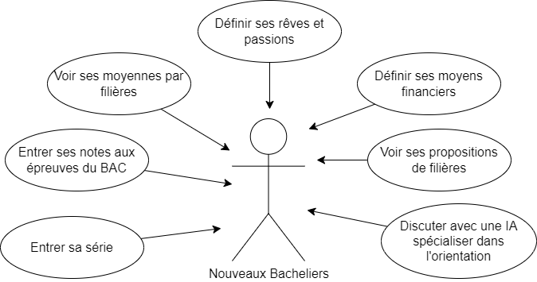

# Gnac Orientation
## But 🚀
Aider les nouveaux bacheliers à mieux s’orienter afin d’avoir une vie professionnelle épanouie. 

## Acteurs
Nouveaux bacheliers

## Diagramme des cas d’utilisation

## Cas d’utilisation
 Nouveaux Bacheliers
### Entrer sa série
Ce cas d’utilisation commence juste après le splash screen au démarrage de l’application. Les acteurs auront toutes les séries face à eux et ils devront en choisir une et une seule pour continuer. Ainsi ce cas d’utilisation se termine lorsque l’acteur appuie sur le bouton “Continuer”.
### Entrer ses notes aux épreuves du BAC
Il commence après le choix de la série. Les acteurs pourront mettre les notes en fonction des matières qu’il décide de remplir jusqu’à ce que toutes les notes soient insérées dans l’appli. Seulement après cela, ils auront la possibilité d'appuyer sur le bouton “Continuer” pour terminer
### Voir ses moyennes par filières
Après avoir renseigné les notes et appuyez sur “Continuer”, ils verront leurs moyennes d'admission classées par Université, faculté, école et en fin filière.
### Définir ses rêves et passions
Ce cas d’utilisation commence lorsque les acteurs appuient sur le bouton “Aller plus loin” de la page des moyennes par filières. Ils verront les domaines, les activités et devront choisir ceux qui les passionnent et dont ils ont toujours rêvé. Il s'arrête après qu’ils aient appuyé sur “Continuer”.
### Définir ces moyens financiers
Il commence après le bouton “Continuer” de la page des Rêves et Passion. Ici, l’acteur mentionne s’il ou ses proches ont les moyens de subvenir à ses frais d’étude universitaire en choisissant parmi trois options : “OUI, NON, PEUT-ÊTRE”. Il s’arrete apres qu’ils aient appuyer sur “Continuer”
### Voir ses propositions de filières
Il commence après le bouton “Continuer” de la page des moyens financiers. Le système lui propose (au moins 3) des filières en fonction de toutes ces précédentes informations que l’acteur a entrées. Maintenant, s’il n’est toujours pas satisfait, il pourra appuyer sur la bulle de discussion pour terminer ce cas d’utilisation.
### Discuter avec une IA spécialisée dans l’orientation 
Ce cas d’utilisation commence après que l’acteur est appuyé sur la bulle de discussion de la page des propositions de filières. Il pourra discuter comme avec une intelligence artificielle spécialisée dans l’orientation des nouveaux bacheliers afin qu’il ait une carrière éblouissante.

